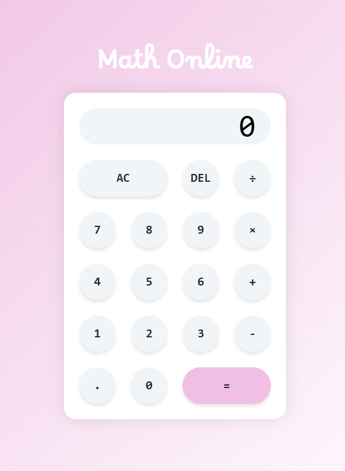

# Math Online

Welcome to Math Online, your online calculator built with vanilla Javascript!



Math Online is a lightweight web-based calculator designed to handle basic arithmetic operations. Built with vanilla JavaScript, this project demonstrates clean and efficient DOM manipulation and provides a smooth user experience with a responsive interface. No frameworks or external libraries are used.

🔗 [go to Math Online](https://math-online.netlify.app/)

## Features

- 🧮 Basic operations (addition, subtraction, multiplication, division)
- 🕹️ Interactive and responsive interface
- 🥇 Support for decimal numbers
- 🔄 Reset and delete buttons

## Technologies Used

- HTML5
- CSS3
- JavaScript (Vanilla)

## Getting Started

To run the project locally, follow these steps:

**1. Clone the repository:**

```javascript
git clone https://github.com/alepuliani/mathonline.git
```

**2. Open the index.html file in your web browser.**

Made with ❤️ by Alessandra
